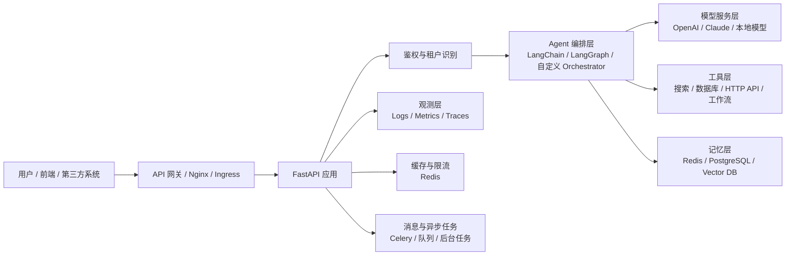
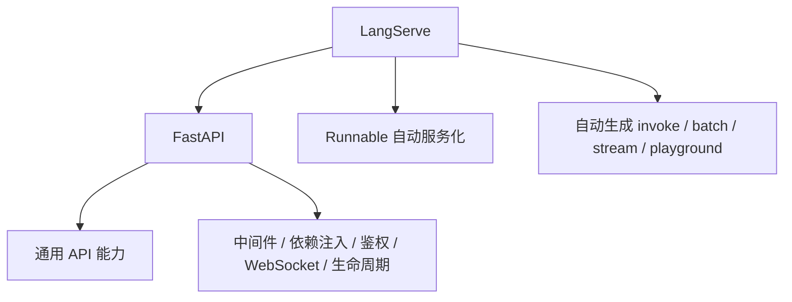
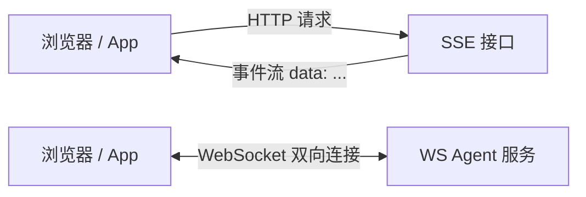
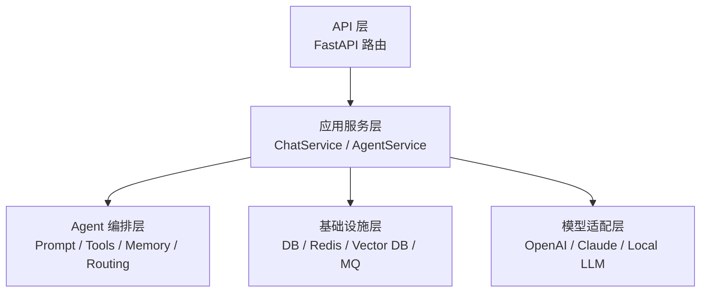
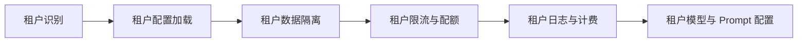
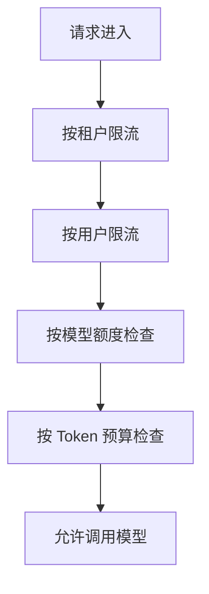
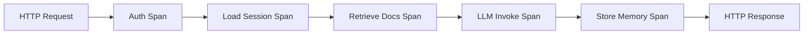
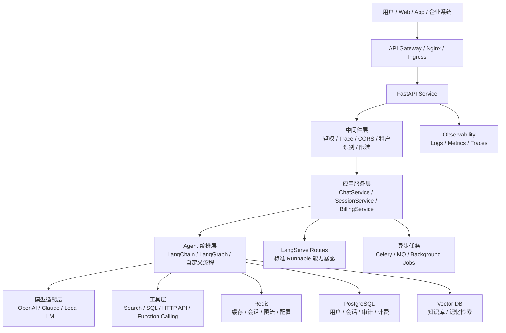

# AI Agent 生产级部署与工程化

## FastAPI / LangServe：把大模型 Agent 封装成高性能 REST / WebSocket API

---

## 1. 大模型 Agent 会遇到哪些问题？

一旦进入真实场景，就会立刻遇到下面这些问题：

- 前端怎么调用？
- 多个用户如何同时使用？
- 响应很慢时，如何流式返回？
- 用户身份、权限、租户怎么隔离？
- 出错了怎么追踪？
- 上线后怎么扩容？
- 一个 Agent 的多个版本如何共存？
- 请求成本、Token 成本、调用次数怎么统计？

所以我们可以把 AI Agent 系统的发展分成三个层次。

### 1.1 三个层次

| 层次 | 形态 | 核心特征 | 典型问题 |
|---|---|---|---|
| L1 | 本地脚本 | 验证 Prompt、验证模型能力 | 只能自己用，无法对外服务 |
| L2 | 单机 Demo API | 用 FastAPI 暴露一个简单接口 | 能调用，但缺少治理能力 |
| L3 | 生产级 Agent 平台 | 多租户、流式、鉴权、监控、部署、限流 | 能稳定支撑真实业务 |

今天我们重点讲的是：如何从 `L1/L2` 走向 `L3`。

---

## 2. 一张图看懂全局




### 2.1 这张图要传达什么？

最重要的是理解：

- `FastAPI` 不是 Agent 本身，它是 Agent 的服务外壳。
- `LangServe` 不是替代 FastAPI，而是建立在 FastAPI 上的“Runnable 服务化加速器”。
- 真正的生产系统，绝对不止一个模型调用函数，而是一整套服务能力的组合。

---

## 3. FastAPI 在 AI Agent 工程里的定位

### 3.1 FastAPI 本质上是什么？

FastAPI 是一个现代 Python Web 框架，擅长做三件事：

1. 定义高性能 HTTP API
2. 天然支持异步
3. 基于类型注解自动生成校验和文档

这三个能力，刚好和 Agent 服务的需求高度契合。


**FastAPI 和 java中的springboot对比**


### 3.2 为什么 Agent 后端很适合 FastAPI？

因为 Agent 后端通常具备这些特点：

- 需要暴露 REST API 给前端、App、企业系统
- 需要长连接或流式响应
- 需要大量 I/O 操作
  - 调 LLM API
  - 查 Redis
  - 查向量库
  - 查 PostgreSQL
  - 调外部工具 API
- 需要结构化输入输出
- 需要自动化接口文档，方便前后端协作

所以 FastAPI 是“Agent 服务层”的天然选择。

### 3.3 FastAPI 在系统中的边界

可以把它理解为：

- 对外：负责接收请求、返回结果
- 对内：负责把请求交给 Agent 编排逻辑
- 横向：负责挂载鉴权、日志、监控、限流、中间件

一句话总结：

> FastAPI 解决的是“如何把 Agent 变成一个可被稳定调用的后端服务”。

---

## 4. FastAPI 基础能力

---

## 4.1 最小可运行应用

```python
from fastapi import FastAPI

app = FastAPI(
    title="Agent API",
    version="1.0.0",
    description="Production-ready AI Agent service"
)

@app.get("/")
async def root():
    return {"message": "Agent service is running"}
```

启动：

```bash
uvicorn main:app --reload
```

你会得到：

- `http://localhost:8000`
- `http://localhost:8000/docs`
- `http://localhost:8000/redoc`

### 讲解重点

- `docs` 自动生成 Swagger UI，这对前端联调极其重要。
- 对 Agent 团队而言，接口文档不是“附赠品”，而是协作基础设施。

---

## 4.2 路径参数、查询参数、请求体

### 路径参数

```python
@app.get("/agents/{agent_id}")
async def get_agent(agent_id: str):
    return {"agent_id": agent_id}
```

### 查询参数

```python
@app.get("/sessions")
async def list_sessions(user_id: str, limit: int = 20):
    return {"user_id": user_id, "limit": limit}
```

### 请求体

```python
from pydantic import BaseModel, Field

class ChatRequest(BaseModel):
    user_id: str
    session_id: str
    message: str = Field(..., min_length=1, max_length=4000)
    stream: bool = False
```

### 为什么这很重要？

因为 Agent 系统的输入往往很复杂：

- 用户输入
- 会话 ID
- 模型参数
- 工具开关
- 检索开关
- 上下文元数据

如果没有结构化请求模型，接口会很快失控。

---

## 4.3 响应模型：为什么比“直接 return dict”更重要？

```python
from pydantic import BaseModel

class ChatResponse(BaseModel):
    answer: str
    model: str
    latency_ms: int
    request_id: str

@app.post("/chat", response_model=ChatResponse)
async def chat(req: ChatRequest):
    return {
        "answer": "你好，我是你的 AI 助手",
        "model": "gpt-4.1",
        "latency_ms": 823,
        "request_id": "req_123"
    }
```

响应模型的价值：

- 规范输出结构
- 自动文档化
- 防止额外敏感字段泄露
- 帮助前端稳定接入

在生产环境中，输出结构稳定，比“先返回出来再说”重要得多。

---

## 4.4 依赖注入：Agent 平台的关键工程手段

FastAPI 的依赖注入可以理解为“请求处理前的可复用准备逻辑”。

典型用途：

- 校验 API Key
- 解析 JWT
- 获取当前用户
- 获取当前租户
- 获取数据库连接
- 获取 Redis 客户端
- 获取请求级 trace id

示例：

```python
from fastapi import Depends, Header, HTTPException

async def get_api_key(x_api_key: str = Header(...)):
    if x_api_key != "demo-key":
        raise HTTPException(status_code=401, detail="Invalid API key")
    return x_api_key

@app.post("/chat")
async def chat(req: ChatRequest, api_key: str = Depends(get_api_key)):
    return {"answer": "ok"}
```

### 在 Agent 系统里更常见的写法

```python
async def get_tenant_context(
    x_tenant_id: str = Header(...),
    authorization: str = Header(...)
):
    # 1. 校验 token
    # 2. 校验租户合法性
    # 3. 加载租户配置
    return {
        "tenant_id": x_tenant_id,
        "plan": "pro",
        "model": "gpt-4.1-mini"
    }
```

这就是平台化思维的开始。

---

## 4.5 中间件：把通用治理逻辑收口

中间件适合做的事情：

- 请求日志
- trace id 注入
- 请求耗时统计
- 跨域
- 全局租户识别
- 全局异常兜底

示例：

```python
import time
from fastapi import Request

@app.middleware("http")
async def add_process_time_header(request: Request, call_next):
    start = time.perf_counter()
    response = await call_next(request)
    elapsed = time.perf_counter() - start
    response.headers["X-Process-Time"] = f"{elapsed:.4f}"
    return response
```


---

## 4.6 异常处理：不要把大模型服务做成“随机报错盒子”

真实的 Agent 服务会出现很多错误：

- 入参错误
- 模型超时
- 模型限流
- 工具调用失败
- 向量库不可用
- 数据库连接池耗尽
- 下游 API 429 / 500

所以需要统一错误模型。

```python
from fastapi import HTTPException

@app.exception_handler(Exception)
async def global_exception_handler(request, exc):
    return JSONResponse(
        status_code=500,
        content={
            "error_code": "INTERNAL_ERROR",
            "message": "Service temporarily unavailable"
        }
    )
```

### 更好的工程实践

建议把错误分成三层：

| 层级 | 示例 | 对外策略 |
|---|---|---|
| 用户输入错误 | 参数缺失、格式错误 | 明确提示 |
| 业务错误 | 超额、权限不足、租户禁用 | 明确错误码 |
| 系统错误 | 模型故障、数据库故障 | 统一兜底，隐藏内部细节 |

---

## 5. Pydantic v2：为什么它是 Agent API 的输入输出基石

Agent 系统和普通 CRUD 系统相比，一个非常大的区别是：

> 它的输入输出天然更加动态、复杂、不稳定。

所以更需要“强约束的数据模型”。

---

## 5.1 一个更接近真实业务的请求模型

```python
from typing import Any, Optional
from pydantic import BaseModel, Field, field_validator

class RetrievalConfig(BaseModel):
    top_k: int = Field(default=5, ge=1, le=20)
    enable_rerank: bool = True

class ChatRequest(BaseModel):
    tenant_id: str
    user_id: str
    session_id: str
    message: str = Field(..., min_length=1, max_length=8000)
    stream: bool = True
    metadata: dict[str, Any] = Field(default_factory=dict)
    retrieval: Optional[RetrievalConfig] = None

    @field_validator("tenant_id", "user_id", "session_id")
    @classmethod
    def not_blank(cls, value: str) -> str:
        value = value.strip()
        if not value:
            raise ValueError("must not be blank")
        return value
```

### 这个模型体现了什么？

- 强约束
- 可扩展
- 嵌套结构
- 可选配置
- 对复杂请求体友好

这就是工程化接口设计。

---

## 5.2 为什么 Pydantic 对 LLM 场景尤其重要？

因为 LLM 场景里有三类“结构化需求”：

1. 用户请求结构化
2. 模型输出结构化
3. 工具调用参数结构化

举例：

- 前端发起聊天请求，需要统一字段
- 模型输出想转成 JSON 给前端渲染
- Agent 调工具时，需要严格校验工具参数

所以 Pydantic 既可以用在 API 层，也可以用在 Agent 内部的数据契约层。

---

## 5.3 Pydantic 在生产中的额外价值

- 自动生成 OpenAPI Schema
- 给 TypeScript SDK 生成提供基础
- 保证前后端字段契约一致
- 减少“看似能跑，其实字段乱套”的问题

一句话：

> 没有数据模型约束的 Agent API，后期一定会越来越难维护。

---

## 6. 异步与并发：这是 FastAPI 做 Agent 服务的核心优势之一

---

## 6.1 为什么 Agent 服务天然是 I/O 密集型？

一次用户请求，通常不会只发生一件事，而是可能包含：

1. 请求鉴权
2. 读取会话历史
3. 读取租户配置
4. 触发检索
5. 调用重排模型
6. 调用主模型
7. 调用外部工具
8. 写回日志与埋点
9. 写回记忆

这些步骤里，大多数都不是 CPU 重计算，而是在“等待外部资源响应”。

这就是典型的 I/O 密集型服务。

### 所以异步的价值是什么？

当一个请求在等待模型返回时，服务器不应该傻等，而应该去服务其他请求。

这就是 `async / await` 的根本价值。

---

## 6.2 一个错误示范

```python
import requests

@app.post("/bad")
async def bad(req: ChatRequest):
    resp = requests.post("https://example.com/llm", json={"q": req.message})
    return resp.json()
```

这个写法的问题是：

- 路由是 `async`
- 但里面用了同步阻塞库 `requests`
- 结果会阻塞事件循环

这会导致并发能力明显下降。

---

## 6.3 正确示范

```python
import httpx

client = httpx.AsyncClient(timeout=60.0)

@app.post("/good")
async def good(req: ChatRequest):
    resp = await client.post(
        "https://example.com/llm",
        json={"q": req.message}
    )
    return resp.json()
```

### 记住一条经验

> 只要你在 `async def` 里访问网络、数据库、缓存、对象存储，优先使用异步客户端。

---

## 6.4 并发控制：为什么不是越高越好？

很多人一开始会觉得：

- 异步很强
- 那我就把所有请求都并发打出去

这在 Agent 场景里非常危险，因为下游往往有限额：

- 模型 API RPM / TPM 限制
- 向量库 QPS 限制
- Redis / DB 连接池限制
- 第三方工具 API 限制

所以必须做并发约束。

```python
import asyncio

llm_semaphore = asyncio.Semaphore(20)

async def call_model(payload: dict):
    async with llm_semaphore:
        return await model.ainvoke(payload)
```

### 这段代码背后的工程意义

- 保护下游
- 避免瞬时雪崩
- 避免把限流错误扩大化
- 更方便按租户、按模型维度做资源配额

---

## 7. LangServe：它是 FastAPI 之上的“Agent 服务化加速器”

---

## 7.1 先理解 Runnable

在 LangChain 体系中，很多对象都遵循 `Runnable` 协议。

它们通常提供这些方法：

- `invoke`
- `ainvoke`
- `batch`
- `stream`
- `astream`

也就是说，一个 Prompt、一个模型、一个链、一个组合流程，本质上都可以被视为“可运行单元”。

**`java.util.function.Function` 或 `CompletableFuture`**


LangServe 的核心价值就在这里：

> 只要它是 Runnable，就可以很快暴露成 API 服务。

---

## 7.2 最小示例

```python
from fastapi import FastAPI
from langserve import add_routes
from langchain_openai import ChatOpenAI
from langchain_core.prompts import ChatPromptTemplate

app = FastAPI()

prompt = ChatPromptTemplate.from_template("请用中文解释：{topic}")
model = ChatOpenAI(model="gpt-4.1-mini")
chain = prompt | model

add_routes(app, chain, path="/explain")
```

这个时候会自动生成：

- `/explain/invoke`
- `/explain/batch`
- `/explain/stream`
- `/explain/astream`
- `/explain/playground`

### 这意味着什么？

原本你自己手写这些端点要花不少时间，LangServe 直接帮你搭好了标准接口。

---

## 7.3 FastAPI 与 LangServe 的关系

很多初学者会误解成二选一。

实际上不是。



正确理解应该是：

- FastAPI 提供通用 Web 服务能力
- LangServe 提供 Runnable 的快速服务化能力
- 两者不是对立，而是上下层关系

---

## 7.4 LangServe 适合什么场景？

非常适合：

- 已经有 LangChain Runnable
- 需要尽快对外暴露服务
- 希望快速获得流式、批处理、playground
- 做内部平台、原型验证、服务封装

不一定适合所有场景：

- 非 LangChain 体系的复杂自定义协议
- 非常特殊的响应格式
- 极复杂的业务编排接口

### 一个很实用的判断标准

如果你的核心逻辑已经是一个 Runnable，那么优先考虑 LangServe。  
如果你的接口协议和业务流程高度定制，那么可以用 FastAPI 手写。

---

## 7.5 RemoteRunnable：服务化之后的另一个价值

```python
from langserve import RemoteRunnable

remote_agent = RemoteRunnable("http://localhost:8000/explain")
result = remote_agent.invoke({"topic": "什么是 RAG"})
```

这意味着：

- 本地 Runnable 可以变成远程 Runnable
- 调用方式几乎一致
- 更容易做服务拆分

从架构上看，这很像把“链”变成“远程能力模块”。

---

## 8. 流式输出：为什么它是 Agent 用户体验的关键

如果一个 Agent 响应要 8 秒，用户在第 8 秒前什么都看不到，体验会非常差。

流式输出的本质是：

> 不等全部生成完，再返回；而是生成一点，立刻发一点。

这样会显著优化两种体验指标：

- 首字延迟
- 等待焦虑

---

## 8.1 SSE 与 WebSocket 的根本区别

### SSE

- 服务端持续向客户端推送文本事件
- 本质仍是 HTTP 连接
- 实现简单，和代理、CDN 配合更友好

### WebSocket

- 双向长连接
- 客户端和服务端都能持续发送消息
- 适合强交互场景

---

## 8.2 一张图看懂



### 经验结论

- 纯文本生成流：优先 SSE
- 需要中途打断、回传工具状态、双向协商：考虑 WebSocket

---

## 8.3 SSE 示例

```python
from fastapi.responses import StreamingResponse

async def event_generator(message: str):
    async for chunk in chain.astream({"topic": message}):
        text = getattr(chunk, "content", str(chunk))
        yield f"data: {text}\n\n"

@app.get("/stream")
async def stream(message: str):
    return StreamingResponse(
        event_generator(message),
        media_type="text/event-stream",
        headers={
            "Cache-Control": "no-cache",
            "Connection": "keep-alive",
            "X-Accel-Buffering": "no"
        }
    )
```

### 

`X-Accel-Buffering: no` 很重要。  
如果前面有 Nginx，而你没关缓冲，前端可能根本看不到逐字流式效果。

---

## 8.4 WebSocket 示例

```python
from fastapi import WebSocket, WebSocketDisconnect

@app.websocket("/ws/chat")
async def websocket_chat(websocket: WebSocket):
    await websocket.accept()
    try:
        while True:
            message = await websocket.receive_text()
            async for chunk in chain.astream({"topic": message}):
                text = getattr(chunk, "content", str(chunk))
                await websocket.send_text(text)
    except WebSocketDisconnect:
        pass
```

### 什么时候 WebSocket 真有必要？

- 实时协作 Agent
- 语音 Agent
- 实时中断生成
- 工具执行进度回传
- 多阶段事件流

---

## 9. 一个更接近真实业务的 Agent API 分层

很多人写 Agent 服务，容易把所有逻辑塞进一个路由函数里。

例如：

- 收请求
- 拼 Prompt
- 调模型
- 记日志
- 写 Redis
- 查数据库
- 返回结果

最后一个函数 300 行。

这几乎不可维护。

### 更好的分层



### 每层职责

| 层 | 责任 |
|---|---|
| API 层 | 收参与返回，鉴权，状态码，协议适配 |
| 应用服务层 | 组织一次完整业务流程 |
| Agent 编排层 | 决定用哪个模型、哪些工具、是否检索 |
| 基础设施层 | 数据访问、缓存、队列、存储 |
| 模型适配层 | 封装具体模型供应商 |

### 这样做的价值

- 易维护
- 易测试
- 易替换模型
- 易扩展多租户
- 易做平台化

---

## 10. 从单 Agent API 到多租户 Agent 平台

这是很多企业场景真正关心的部分。

单个 Agent 能跑起来，不代表平台能跑起来。

平台化意味着：

- 多个客户共用同一套系统
- 每个客户有独立配置、独立数据、独立额度
- 平台需要稳定、安全、可治理

---

## 10.1 什么叫多租户？

“租户”可以理解为平台中的一个独立客户组织。

例如：

- 一个 SaaS 平台服务 100 家企业
- 每家企业都有自己的用户、知识库、调用额度、模型配置
- 彼此之间绝不能串数据

这就是多租户。

---

## 10.2 多租户系统核心能力



### 你要记住，多租户不是只加一个 `tenant_id`

它至少包含：

- 身份识别
- 数据隔离
- 配额治理
- 配置差异化
- 成本统计
- 安全审计

---

## 10.3 租户识别方案

常见方案：

| 方案 | 说明 | 适用性 |
|---|---|---|
| Header | 如 `X-Tenant-ID` | 最简单，适合内部服务 |
| JWT Claim | token 内包含 tenant_id | 更常见，适合正式系统 |
| 子域名 | `tenant-a.example.com` | 适合 SaaS 门户 |
| API Key 绑定租户 | key 与租户一一映射 | Open API 场景常见 |

示例：

```python
from fastapi import Request, HTTPException

@app.middleware("http")
async def tenant_middleware(request: Request, call_next):
    tenant_id = request.headers.get("X-Tenant-ID")
    if not tenant_id:
        raise HTTPException(status_code=400, detail="Missing tenant id")
    request.state.tenant_id = tenant_id
    return await call_next(request)
```

---

## 10.4 数据隔离：多租户最敏感的部分

常见隔离方式：

| 方案 | 优点 | 缺点 | 适合阶段 |
|---|---|---|---|
| 表内字段隔离 | 简单 | 容易漏过滤 | MVP |
| Schema 隔离 | 平衡性较好 | 运维稍复杂 | 成长期 |
| 独立数据库隔离 | 安全性高 | 成本高 | 大客户 / 高安全场景 |

### PostgreSQL Schema 隔离思路

```sql
CREATE SCHEMA tenant_a;
CREATE TABLE tenant_a.sessions (...);
CREATE TABLE tenant_a.messages (...);
```

请求来了之后切换：

```sql
SET search_path TO tenant_a;
```

### 注意点

- 不要直接拼接不可信 schema 名称
- 必须做好白名单校验
- 必须在连接池场景下正确恢复上下文

---

## 10.5 缓存与记忆也要隔离

很多团队只注意数据库隔离，却忽略缓存和记忆层。

这是非常危险的。

### Redis Key 设计示例

```text
tenant:{tenant_id}:session:{session_id}:messages
tenant:{tenant_id}:ratelimit:{user_id}
tenant:{tenant_id}:config:agent
```

### 向量库过滤示例

每条文档元数据带上：

```json
{
  "tenant_id": "tenant_a",
  "kb_id": "kb_001",
  "doc_id": "doc_123"
}
```

检索时必须带过滤条件。

一句话：

> 多租户隔离必须贯彻到数据库、缓存、对象存储、向量库、日志、监控、计费的每一层。

---

## 10.6 限流与配额：平台治理的核心

如果没有限流，两个问题一定会出现：

1. 个别用户打爆成本
2. 一个租户影响所有租户

所以必须做：

- 按租户限流
- 按用户限流
- 按接口限流
- 按模型限额
- 按 Token 配额

### 限流维度示意



### 实战中常用的指标

- 每分钟请求数
- 每天请求数
- 每天输入 Token
- 每天输出 Token
- 并发会话数

---

## 11. 生产部署：从“能跑”到“稳定运行”

---

### 11.1 什么是uvicorn --reload？

是一个**开发模式启动命令**，用于运行 Python 的 ASGI 应用（比如 FastAPI）

| 部分       | 含义                                           |
| :--------- | :--------------------------------------------- |
| `uvicorn`  | Python 的 ASGI 服务器，用于运行异步 Web 应用   |
| `--reload` | 启用**自动重启**功能，代码变更时服务器自动重启 |

## `--reload` 具体做了什么？

当你修改代码并保存文件时，`--reload` 会：

1. **检测文件变化**：监控项目目录下的 `.py` 文件
2. **自动重启服务器**：终止当前进程，重新启动一个新的 uvicorn 进程
3. **加载新代码**：让修改立即生效，无需手动重启

┌─────────────────────────────────────────────┐
│  1. uvicorn 启动主进程                     															  │
│  2. 启动一个子进程加载应用代码               													│
│  3. 启动文件监控线程（watchdog）            												│
│  4. 检测到文件变更 → 终止子进程            													│
│  5. 重新启动新的子进程 → 加载新代码         												│
└─────────────────────────────────────────────┘


## 11.1 为什么 `uvicorn --reload` 不等于生产部署？

因为它只是开发模式。

生产部署关注的是：

- 多 worker
- 进程管理
- 超时设置
- 日志输出
- 优雅重启
- 资源限制
- 健康检查

### 常见部署组合

| 组件 | 作用 |
|---|---|
| Nginx / Ingress | 反向代理、TLS、路径转发 |
| Gunicorn | 多进程管理 |
| Uvicorn Worker | 运行 ASGI 应用 |
| FastAPI | 业务服务 |

---

## 11.2 典型启动方式

```bash
gunicorn main:app \
  --workers 4 \
  --worker-class uvicorn.workers.UvicornWorker \
  --bind 0.0.0.0:8000 \
  --timeout 120 \
  --graceful-timeout 30 \
  --keep-alive 10 \
  --log-level info
```

### 参数怎么理解？

- `workers`：多进程，提升吞吐和隔离性
- `timeout`：防止长时间卡死
- `graceful-timeout`：优雅退出窗口
- `keep-alive`：连接复用

### 但要注意

流式接口会占用连接更久。  
所以 worker 数量、连接数、超时策略要结合流式业务来调优。

---

## 11.3 Docker 化

```dockerfile
FROM python:3.11-slim

WORKDIR /app

COPY requirements.txt .
RUN pip install --no-cache-dir -r requirements.txt

COPY . .

CMD ["gunicorn", "main:app", \
     "--worker-class", "uvicorn.workers.UvicornWorker", \
     "--bind", "0.0.0.0:8000", \
     "--workers", "4"]
```

### Docker 的意义

- 环境一致
- 便于交付
- 便于容器编排
- 便于灰度发布与回滚

---

## 11.4 Kubernetes 视角下要关心什么？

如果进入 K8s，重点不再只是“程序能不能启动”，而是：

- readiness probe
- liveness probe
- HPA 自动扩缩容
- 配置与密钥注入
- Pod 资源限制
- 滚动升级

### 健康检查接口示例

```python
@app.get("/healthz")
async def healthz():
    return {"status": "ok"}

@app.get("/readyz")
async def readyz():
    # 可额外检查 Redis、DB、模型网关连通性
    return {"status": "ready"}
```

---

## 12. 可观测性：没有观测，就没有生产级系统

很多 Agent 项目失败，不是因为模型差，而是因为出了问题根本查不清。

所以必须建立三件套：

- Logs
- Metrics
- Traces

---

## 12.1 Logs：回答“发生了什么”

建议日志中至少包含：

- request_id
- tenant_id
- user_id
- endpoint
- latency_ms
- model_name
- prompt_tokens
- completion_tokens
- status

### 一条好的日志要能支撑什么？

- 排查错误
- 审计调用
- 统计成本
- 做问题复盘

---

## 12.2 Metrics：回答“系统整体怎么样”

常见指标：

- QPS
- P95 / P99 延迟
- 错误率
- 并发连接数
- 模型调用成功率
- 每租户 Token 消耗
- 流式首包时间

### 对 Agent 很关键的两个指标

1. 首字延迟
2. 完整响应耗时

因为用户感知非常依赖这两个指标。

---

## 12.3 Traces：回答“一次请求经过了哪些步骤”



一条完整 Trace 能告诉你：

- 卡在鉴权？
- 卡在 Redis？
- 卡在向量检索？
- 卡在模型调用？
- 卡在后处理？

这对 Agent 系统非常关键，因为它本身就是一个多步骤编排系统。

---

## 12.4 OpenTelemetry 是什么

OpenTelemetry（简称 **OTel**）是一个**开源、厂商中立的可观测性框架**，可以理解为现代云原生应用的“数据采集标准件

它的核心任务是帮助开发者**生成、采集和导出**三类关键的遥测数据（也就是系统的运行信号），让我们能看清系统内部的状态

### 它具体做什么？

你可以把它想象成一个**通用数据采集器**，它主要采集这三类数据：

1. **链路 (Traces)**：记录一个请求（比如用户点击“加入购物车”）在复杂的微服务系统中完整流转路径。它由多个**跨度 (Spans)** 组成，每个跨度代表一个具体操作（如“查询库存”、“更新订单”），能帮你精准定位性能瓶颈。

2. **指标 (Metrics)**：对系统运行状况的数值化汇总，例如“过去5分钟的请求总数”、“当前CPU使用率”等。这些数据通常用来监控系统健康和设定告警。

3. **日志 (Logs)**：系统在某个时间点留下的带时间戳的文本记录。OpenTelemetry 能将日志与特定的链路和跨度关联起来，让排查问题时上下文更清晰。

   

## 12.5 OpenTelemetry 为什么重要？

因为它是观测标准，而不是某家厂商私有方案。

你可以：

- 接 FastAPI
- 接 httpx
- 接数据库驱动
- 接 Redis
- 最后输出到 Jaeger、Tempo、Grafana、Datadog 等

这能帮你把“黑盒 Agent”变成“透明流水线”。


## 12.6 如何接入？两种插桩方式

要让你的应用“开口说话”，需要通过“插桩”来接入 OpenTelemetry，主要有两种方式：

#### 1 零代码方案 (Zero-code)：无需修改业务代码。例如，在 Java 应用中，启动时附加一个 `-javaagent` 代理 jar 包，就能自动捕获 HTTP 请求、数据库操作等行为，非常适合快速入门。

### Python 零代码接入步骤

1. **安装核心包**：首先，你需要安装OpenTelemetry的Python发行版和导出器。

   bash

   ```
   pip install opentelemetry-distro opentelemetry-exporter-otlp
   ```

   

2. **安装特定库的插桩**：运行`opentelemetry-bootstrap`命令，它会自动检测你项目中已安装的依赖库，并为它们安装对应的OpenTelemetry插桩包（例如，如果检测到`fastapi`，就会安装`opentelemetry-instrumentation-fastapi`）。

   bash

   ```
   opentelemetry-bootstrap -a install
   ```

   

3. **配置并启动应用**：通过环境变量或命令行参数进行配置（如服务名、数据导出地址），然后使用`opentelemetry-instrument`命令来启动你的Python应用。

   - **方式一：使用命令行参数配置**：

     bash

     ```
     opentelemetry-instrument \
         --service_name your-service-name \
         --exporter_otlp_endpoint 0.0.0.0:4317 \
         python myapp.py
     ```


### 2.**基于代码的方案 (Code-based)**：在代码中显式调用 OpenTelemetry 提供的 API。这种方式更灵活，能自定义采集更丰富的业务数据。


---


## 13. 安全：生产级 Agent 服务绝不能忽视的一环

### 至少要考虑这些问题

- 未授权调用
- Prompt 注入
- 工具滥用
- 敏感数据泄露
- 跨租户数据泄露
- 日志中记录了隐私信息
- 上传文档未做校验

---

## 13.1 安全最小清单

| 类别 | 最低要求 |
|---|---|
| 身份认证 | JWT / API Key |
| 权限控制 | 用户、租户、角色分级 |
| 数据隔离 | DB / Cache / Vector 全链路隔离 |
| 输入校验 | Pydantic + 文件类型校验 |
| 超时控制 | 防止请求长时间占用资源 |
| 工具白名单 | Agent 只能调用允许的工具 |
| 日志脱敏 | 不落敏感字段原文 |

### 一句提醒

Agent 比传统 API 更危险的地方在于：

> 它会“推理”，会“调用工具”，会“访问知识”，所以可攻击面更大。

---

## 14. 常见生产陷阱

这一部分特别适合演讲时提醒听众。

### 陷阱 1：在 `async def` 里使用同步库

后果：

- 阻塞事件循环
- 并发能力明显下降

### 陷阱 2：流式接口经过代理后不再流式

后果：

- 前端一直卡住
- 用户以为没响应

原因：

- Nginx 缓冲未关闭
- CDN / 网关对流式支持不足

### 陷阱 3：只隔离数据库，不隔离 Redis 和向量库

后果：

- 多租户串数据

### 陷阱 4：没有超时与重试策略

后果：

- 下游卡死，服务线程持续占用

### 陷阱 5：没有限流

后果：

- 成本失控
- 下游被打爆
- 某个租户拖垮全局

### 陷阱 6：日志里直接打印完整 Prompt 与用户隐私

后果：

- 安全与合规风险

---

## 15. 技术选型建议：什么时候选 FastAPI，什么时候加 LangServe？

| 场景 | 推荐 |
|---|---|
| 只是做标准 REST API，业务很自定义 | FastAPI |
| 已经有 LangChain Runnable，想快速暴露服务 | FastAPI + LangServe |
| 要做流式聊天接口 | FastAPI，必要时配 LangServe |
| 要做多租户平台 | FastAPI 为主，LangServe 作为能力暴露组件 |
| 要做高度定制协议和复杂治理 | FastAPI 手写更灵活 |


---


## 17. 完整架构图



### 这张图是整场分享最重要的认知总结

希望大家最后带走的不是几个代码片段，而是一个判断框架：

- 哪一层负责什么？
- 哪些能力必须具备？
- 一个 Demo 到底缺了哪些生产能力？
- 什么时候该引入 LangServe，什么时候该强化 FastAPI 原生能力？

---

## 18. 总结

最后把今天的内容浓缩成 8 句话。

1. Agent 进入真实业务后，核心问题不再只是“能不能回答”，而是“能不能稳定服务”。
2. FastAPI 是把 Agent 封装成后端服务的核心框架。
3. LangServe 适合把 Runnable 快速暴露成标准 API。
4. 异步与流式输出决定了 Agent 服务的并发能力和用户体验。
5. 多租户不是一个字段，而是一整套隔离与治理体系。
6. 生产部署不止是启动服务，还包括健康检查、扩缩容、超时与优雅关闭。
7. 没有日志、指标、链路追踪，就谈不上真正的生产级。
8. 真正的工程化目标，是把“模型能力”变成“稳定、可治理、可迭代的产品能力”。


---

## 参考资料

- FastAPI 官方文档：https://fastapi.tiangolo.com/
- LangServe GitHub：https://github.com/langchain-ai/langserve
- Pydantic 官方文档：https://docs.pydantic.dev/
- OpenTelemetry 官方文档：https://opentelemetry.io/

