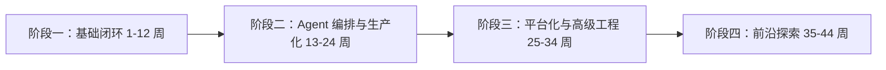

# AI Agent 技术栈学习计划（审查版）

> 审查结论：原方案方向合理，适合作为团队 AI Agent 技术栈全景学习路线；但建议把“8 周精通 14 项基础技术”调整为“10-12 周跑通并形成 MVP”，并把 LangGraph、工程化、安全与评估提前纳入主线。

## 一、二次审查结论

### 1. 原方案合理的地方

- 技术覆盖完整：覆盖 LLM API、Prompt、RAG、Agent 编排、MCP、工具调用、部署、安全、评估、可观测性和前沿能力。
- 学习阶段基本正确：从基础开发能力，到多 Agent 与状态管理，再到生产化与前沿探索，方向合理。
- 团队分工有价值：每个成员有主攻方向，利于形成技术负责人机制。
- 产出物导向正确：每个技术点都要求 Demo、Pipeline、报告或系统，有助于避免只看文档不落地。

### 2. 需要调整的地方

- 阶段一偏重：8 周内掌握 14 项并达到精通不现实，建议改为 10-12 周。
- LangGraph 应提前：生产级 Agent 很多是状态流和流程编排问题，应在阶段一了解、阶段二深入。
- AutoGen / CrewAI / LangGraph 不应同等深入：建议 LangGraph 作为主线，CrewAI 和 AutoGen 作为对比学习。
- Docker 与 K8s 应拆分：Docker 可早学，Kubernetes 可推迟到生产深化阶段。
- 需要补充基础工程能力：Python 工程化、异步编程、测试、CI/CD、鉴权、日志、配置、成本控制等。
- 验收标准需要量化：每个项目应定义可运行、可测试、可评估的验收标准。

### 3. 调整后的学习原则

1. 先跑通闭环，再追求框架全面。
2. 以 LangGraph + RAG + Tool Calling + FastAPI 作为主交付主线。
3. 每阶段必须有可运行项目，而不是只产出笔记。
4. 每个知识点都要形成：学习笔记、代码 Demo、问题记录、最佳实践总结。
5. 框架学习要服务于产品交付，不为学框架而学框架。

---

## 二、总学习路线



| 阶段 | 周期 | 核心目标 | 主要产出 |
|---|---:|---|---|
| 阶段一 | 1-12 周 | 跑通 LLM + RAG + Tool Calling + API 服务闭环 | 企业知识库问答 Agent MVP |
| 阶段二 | 13-24 周 | 掌握 LangGraph、多 Agent、监控、安全、部署 | 生产级多 Agent 工作流系统 |
| 阶段三 | 25-34 周 | 掌握私有化、异步任务、多租户、平台化能力 | 多租户 Agent 平台原型 |
| 阶段四 | 35-44 周 | 探索 GUI、多模态、微调等前沿方向 | 前沿能力 Demo 与评估报告 |

---

## 三、详细学习计划与参考资料

## 阶段一：基础闭环（第 1-12 周）

### 1. Prompt Engineering

- 建议周期：1 周
- 学习目标：掌握系统提示词、Few-shot、CoT、ReAct、输出格式约束、提示词评估。
- 实战产出：团队 Prompt 模板库。
- 参考资料：
  - OpenAI Prompt Engineering Guide：https://platform.openai.com/docs/guides/prompt-engineering
  - Anthropic Prompt Engineering：https://docs.anthropic.com/en/docs/build-with-claude/prompt-engineering/overview
  - DeepLearning.AI ChatGPT Prompt Engineering：https://www.deeplearning.ai/short-courses/chatgpt-prompt-engineering-for-developers/
  - Prompting Guide：https://www.promptingguide.ai/

### 2. 结构化输出 / JSON Schema / Instructor

- 建议周期：1 周
- 学习目标：让模型稳定输出符合 Schema 的 JSON，掌握校验、重试与异常处理。
- 实战产出：信息抽取 Agent。
- 参考资料：
  - OpenAI Structured Outputs：https://platform.openai.com/docs/guides/structured-outputs
  - Anthropic Tool Use：https://docs.anthropic.com/en/docs/agents-and-tools/tool-use/overview
  - Instructor 官方文档：https://python.useinstructor.com/
  - Pydantic 文档：https://docs.pydantic.dev/latest/

### 3. OpenAI API

- 建议周期：1 周
- 学习目标：掌握文本、视觉、函数调用、流式输出、结构化输出。
- 实战产出：LLM 应用 Demo。
- 参考资料：
  - OpenAI Docs：https://platform.openai.com/docs
  - OpenAI Cookbook：https://cookbook.openai.com/
  - OpenAI API Reference：https://platform.openai.com/docs/api-reference

### 4. Anthropic Claude API

- 建议周期：1 周
- 学习目标：掌握 Messages API、工具调用、长上下文处理、多轮对话。
- 实战产出：复杂推理 Agent Demo。
- 参考资料：
  - Anthropic Docs：https://docs.anthropic.com/
  - Claude Tool Use：https://docs.anthropic.com/en/docs/agents-and-tools/tool-use/overview
  - Anthropic Cookbook：https://github.com/anthropics/anthropic-cookbook

### 5. Function Calling / Tool Use

- 建议周期：1-2 周
- 学习目标：掌握工具定义、参数 Schema、工具调用链路、失败重试、权限边界。
- 实战产出：可调用数据库/API/文件工具的 Agent。
- 参考资料：
  - OpenAI Function Calling：https://platform.openai.com/docs/guides/function-calling
  - Anthropic Tool Use：https://docs.anthropic.com/en/docs/agents-and-tools/tool-use/overview
  - LangChain Tools：https://python.langchain.com/docs/concepts/tools/

### 6. Embedding 模型

- 建议周期：1 周
- 学习目标：理解文本向量化、相似度、召回质量、Embedding 评估。
- 实战产出：Embedding 模型对比报告。
- 参考资料：
  - OpenAI Embeddings：https://platform.openai.com/docs/guides/embeddings
  - Hugging Face MTEB：https://huggingface.co/spaces/mteb/leaderboard
  - BGE Embeddings：https://github.com/FlagOpen/FlagEmbedding
  - Cohere Embed：https://docs.cohere.com/docs/embeddings

### 7. 向量数据库 Qdrant / Chroma / Pinecone / Weaviate

- 建议周期：1-2 周
- 学习目标：掌握向量写入、检索、过滤、集合管理、混合检索。
- 实战产出：语义检索服务。
- 参考资料：
  - Qdrant Docs：https://qdrant.tech/documentation/
  - Chroma Docs：https://docs.trychroma.com/
  - Pinecone Docs：https://docs.pinecone.io/
  - Weaviate Docs：https://weaviate.io/developers/weaviate

### 8. 文档解析 Unstructured / Docling / PyMuPDF

- 建议周期：1-2 周
- 学习目标：解析 PDF、Word、Excel、HTML，处理表格、图片、分块和元数据。
- 实战产出：多格式文档解析 Pipeline。
- 参考资料：
  - Unstructured Docs：https://docs.unstructured.io/
  - IBM Docling：https://github.com/docling-project/docling
  - PyMuPDF Docs：https://pymupdf.readthedocs.io/
  - LlamaIndex Document Loading：https://docs.llamaindex.ai/en/stable/module_guides/loading/

### 9. RAG 基础

- 建议周期：2 周
- 学习目标：掌握文档切分、Embedding、召回、上下文组装、回答生成和引用来源。
- 实战产出：企业知识库问答系统。
- 参考资料：
  - LangChain RAG Tutorials：https://python.langchain.com/docs/tutorials/rag/
  - LlamaIndex RAG Guide：https://docs.llamaindex.ai/en/stable/understanding/rag/
  - OpenAI RAG Cookbook：https://cookbook.openai.com/

### 10. LangChain

- 建议周期：2-3 周
- 学习目标：掌握模型、Prompt、Retriever、Tools、Output Parser、Runnable。
- 实战产出：LangChain RAG + Tool Agent Demo。
- 参考资料：
  - LangChain Python Docs：https://python.langchain.com/docs/introduction/
  - LangChain Tutorials：https://python.langchain.com/docs/tutorials/
  - LangChain Academy：https://academy.langchain.com/

### 11. LlamaIndex

- 建议周期：1-2 周
- 学习目标：掌握数据摄取、索引、查询引擎、路由、文档知识库构建。
- 实战产出：企业知识库检索与摘要系统。
- 参考资料：
  - LlamaIndex Docs：https://docs.llamaindex.ai/
  - LlamaIndex Examples：https://github.com/run-llama/llama_index/tree/main/docs/docs/examples
  - LlamaIndex RAG Guide：https://docs.llamaindex.ai/en/stable/understanding/rag/

### 12. LangGraph 入门

- 建议周期：1 周
- 学习目标：理解 State、Node、Edge、条件分支、循环和基础状态流。
- 实战产出：带条件分支的基础 Agent 工作流。
- 参考资料：
  - LangGraph Docs：https://langchain-ai.github.io/langgraph/
  - LangGraph Tutorials：https://langchain-ai.github.io/langgraph/tutorials/
  - LangChain Academy LangGraph：https://academy.langchain.com/

### 13. 短期记忆 / 对话历史管理

- 建议周期：1 周
- 学习目标：掌握滑动窗口、摘要压缩、Token 预算、多轮上下文管理。
- 实战产出：长会话助理 Agent。
- 参考资料：
  - LangGraph Memory：https://langchain-ai.github.io/langgraph/concepts/memory/
  - LangChain Messages：https://python.langchain.com/docs/concepts/messages/
  - Anthropic Context Windows：https://docs.anthropic.com/

### 14. FastAPI / API 服务封装

- 建议周期：1-2 周
- 学习目标：将 Agent 封装成 REST / SSE / WebSocket 服务，支持流式输出和错误处理。
- 实战产出：Agent API 服务。
- 参考资料：
  - FastAPI Docs：https://fastapi.tiangolo.com/
  - FastAPI WebSockets：https://fastapi.tiangolo.com/advanced/websockets/
  - LangServe：https://github.com/langchain-ai/langserve

### 15. LangSmith 调试追踪

- 建议周期：0.5-1 周
- 学习目标：掌握 Trace、Dataset、Evaluation、回归测试。
- 实战产出：Agent 调试追踪 Dashboard。
- 参考资料：
  - LangSmith Docs：https://docs.smith.langchain.com/
  - LangSmith Evaluation：https://docs.smith.langchain.com/evaluation

### 16. Python 工程化基础

- 建议周期：贯穿阶段一
- 学习目标：掌握项目结构、依赖管理、环境变量、日志、测试、类型提示。
- 实战产出：标准化 Agent 项目模板。
- 参考资料：
  - Python Packaging User Guide：https://packaging.python.org/
  - pytest Docs：https://docs.pytest.org/
  - Ruff Docs：https://docs.astral.sh/ruff/
  - uv Docs：https://docs.astral.sh/uv/
  - Python logging：https://docs.python.org/3/library/logging.html

### 阶段一综合项目

- 项目：企业知识库问答 Agent MVP
- 必须包含：文档上传、解析、Embedding、向量检索、RAG 问答、工具调用、短期记忆、流式 API、Trace。
- 验收标准：
  - 支持 PDF / Word / Markdown 至少 3 种文档格式。
  - 至少接入 1 个向量数据库。
  - 支持至少 3 个工具调用。
  - 每次调用可在 LangSmith 中追踪。
  - 有 README、启动脚本、测试样例。

---

## 阶段二：Agent 编排与生产化（第 13-24 周）

### 17. LangGraph 深入

- 建议周期：3-4 周
- 学习目标：掌握复杂状态机、Checkpoint、Human-in-the-loop、子图、持久化恢复。
- 实战产出：审批流 Agent。
- 参考资料：
  - LangGraph Docs：https://langchain-ai.github.io/langgraph/
  - LangGraph Persistence：https://langchain-ai.github.io/langgraph/concepts/persistence/
  - LangGraph Human-in-the-loop：https://langchain-ai.github.io/langgraph/concepts/human_in_the_loop/

### 18. AutoGen / AG2

- 建议周期：1 周
- 学习目标：了解多 Agent 对话协作、群组对话、代码生成与审查场景。
- 实战产出：代码审查多 Agent Demo。
- 参考资料：
  - Microsoft AutoGen：https://github.com/microsoft/autogen
  - AutoGen Docs：https://microsoft.github.io/autogen/
  - AG2 Docs：https://docs.ag2.ai/

### 19. CrewAI

- 建议周期：1 周
- 学习目标：了解角色型 Agent、任务编排、Crew 流程。
- 实战产出：内容生产或市场分析 Crew Demo。
- 参考资料：
  - CrewAI Docs：https://docs.crewai.com/
  - CrewAI GitHub：https://github.com/crewAIInc/crewAI

### 20. MCP Model Context Protocol

- 建议周期：1-2 周
- 学习目标：开发 MCP Server，统一接入文件、数据库、GitHub 等工具。
- 实战产出：MCP 工具服务器。
- 参考资料：
  - MCP Official Docs：https://modelcontextprotocol.io/
  - MCP Python SDK：https://github.com/modelcontextprotocol/python-sdk
  - MCP TypeScript SDK：https://github.com/modelcontextprotocol/typescript-sdk

### 21. 长期记忆 Mem0 / Zep

- 建议周期：1-2 周
- 学习目标：掌握跨会话用户偏好、事实记忆、记忆检索与更新。
- 实战产出：个性化助理 Agent。
- 参考资料：
  - Mem0 Docs：https://docs.mem0.ai/
  - Mem0 GitHub：https://github.com/mem0ai/mem0
  - Zep Docs：https://help.getzep.com/
  - Zep GitHub：https://github.com/getzep/zep

### 22. Agent 状态持久化 Redis / PostgreSQL

- 建议周期：1-2 周
- 学习目标：掌握任务中断恢复、状态存储、Checkpoint、任务审计。
- 实战产出：可断点续跑的长流程 Agent。
- 参考资料：
  - Redis Docs：https://redis.io/docs/latest/
  - PostgreSQL Docs：https://www.postgresql.org/docs/
  - LangGraph Persistence：https://langchain-ai.github.io/langgraph/concepts/persistence/

### 23. 重排序模型 Reranker / CrossEncoder

- 建议周期：1 周
- 学习目标：提升 RAG 检索质量，掌握召回 + 精排两阶段架构。
- 实战产出：高精度 RAG Pipeline。
- 参考资料：
  - Cohere Rerank：https://docs.cohere.com/docs/reranking
  - BGE Reranker：https://github.com/FlagOpen/FlagEmbedding
  - Sentence Transformers CrossEncoder：https://www.sbert.net/examples/cross_encoder/applications/README.html

### 24. RAG 评估 RAGAS / DeepEval

- 建议周期：1-2 周
- 学习目标：评估忠实度、相关性、召回准确率、答案质量。
- 实战产出：RAG 自动评估报告。
- 参考资料：
  - RAGAS Docs：https://docs.ragas.io/
  - RAGAS GitHub：https://github.com/explodinggradients/ragas
  - DeepEval Docs：https://docs.confident-ai.com/
  - DeepEval GitHub：https://github.com/confident-ai/deepeval

### 25. LLM 可观测性 LangFuse / Phoenix / Helicone

- 建议周期：1 周
- 学习目标：监控 Token、延迟、错误率、Prompt 版本、成本和用户反馈。
- 实战产出：生产监控 Dashboard。
- 参考资料：
  - Langfuse Docs：https://langfuse.com/docs
  - Arize Phoenix：https://docs.arize.com/phoenix
  - Helicone Docs：https://docs.helicone.ai/

### 26. Guardrails / 安全护栏

- 建议周期：1-2 周
- 学习目标：实现输出约束、有害内容过滤、业务规则合规、PII 保护。
- 实战产出：Agent 安全护栏系统。
- 参考资料：
  - Guardrails AI Docs：https://www.guardrailsai.com/docs
  - NeMo Guardrails：https://docs.nvidia.com/nemo/guardrails/
  - OpenAI Moderation：https://platform.openai.com/docs/guides/moderation

### 27. Prompt Injection Defense

- 建议周期：1-2 周
- 学习目标：识别提示注入、数据泄露、越权工具调用、间接注入攻击。
- 实战产出：安全审计报告与注入检测机制。
- 参考资料：
  - OWASP Top 10 for LLM Apps：https://owasp.org/www-project-top-10-for-large-language-model-applications/
  - Lakera Prompt Injection Guide：https://www.lakera.ai/blog/guide-to-prompt-injection
  - Promptfoo Security Testing：https://www.promptfoo.dev/docs/red-team/

### 28. 浏览器自动化 Playwright / Browser Use

- 建议周期：1-2 周
- 学习目标：实现网页信息采集、表单操作、流程自动化。
- 实战产出：Web 自动化 Agent。
- 参考资料：
  - Playwright Docs：https://playwright.dev/python/
  - Puppeteer Docs：https://pptr.dev/
  - Browser Use GitHub：https://github.com/browser-use/browser-use

### 29. 代码执行沙箱 E2B / Modal

- 建议周期：1-2 周
- 学习目标：让 Agent 安全执行 Python 代码、数据分析、测试和绘图。
- 实战产出：安全代码执行 Agent。
- 参考资料：
  - E2B Docs：https://e2b.dev/docs
  - Modal Docs：https://modal.com/docs
  - OpenAI Code Interpreter Guide：https://platform.openai.com/docs/assistants/tools/code-interpreter

### 30. Docker / Docker Compose

- 建议周期：1-2 周
- 学习目标：掌握容器化、环境隔离、服务编排、镜像构建。
- 实战产出：Agent 服务 Docker 化部署。
- 参考资料：
  - Docker Docs：https://docs.docker.com/
  - Docker Compose：https://docs.docker.com/compose/
  - FastAPI Docker Deployment：https://fastapi.tiangolo.com/deployment/docker/

### 阶段二综合项目

- 项目：生产级多 Agent 知识工作流系统
- 必须包含：LangGraph 工作流、多工具调用、MCP、长期记忆、RAG 评估、监控、安全防护、Docker 部署。
- 验收标准：
  - 支持任务中断恢复。
  - 支持人工审核节点。
  - 至少 5 条安全攻击样例可被检测或拦截。
  - 有自动评估报告。
  - 可一键 Docker Compose 启动。

---

## 阶段三：平台化与高级工程（第 25-34 周）

### 31. Pydantic AI

- 建议周期：1 周
- 学习目标：构建强类型、可校验、可测试的生产级 Agent。
- 实战产出：强类型结构化抽取 Agent。
- 参考资料：
  - Pydantic AI Docs：https://ai.pydantic.dev/
  - Pydantic Docs：https://docs.pydantic.dev/latest/

### 32. 开源模型 Llama / Qwen / Mistral

- 建议周期：2-3 周
- 学习目标：掌握本地部署、量化推理、vLLM 服务化、私有化 Agent。
- 实战产出：私有化 Agent 系统。
- 参考资料：
  - Hugging Face Transformers：https://huggingface.co/docs/transformers
  - Ollama Docs：https://github.com/ollama/ollama
  - vLLM Docs：https://docs.vllm.ai/
  - Qwen Docs：https://qwen.readthedocs.io/
  - Mistral Docs：https://docs.mistral.ai/

### 33. Agent 托管平台 LangGraph Platform / Modal / Vertex AI

- 建议周期：1 周
- 学习目标：掌握 Serverless Agent 部署、云端任务运行和低运维交付。
- 实战产出：Serverless Agent 部署方案。
- 参考资料：
  - LangGraph Platform：https://langchain-ai.github.io/langgraph/concepts/langgraph_platform/
  - Modal Docs：https://modal.com/docs
  - Vertex AI Docs：https://cloud.google.com/vertex-ai/docs

### 34. 消息队列 RabbitMQ / Kafka / Redis Streams / Celery

- 建议周期：2-3 周
- 学习目标：掌握异步任务、批处理、事件驱动、失败重试和任务监控。
- 实战产出：异步高并发 Agent 任务系统。
- 参考资料：
  - Celery Docs：https://docs.celeryq.dev/
  - RabbitMQ Docs：https://www.rabbitmq.com/docs
  - Kafka Docs：https://kafka.apache.org/documentation/
  - Redis Streams：https://redis.io/docs/latest/develop/data-types/streams/

### 35. Kubernetes

- 建议周期：2-3 周
- 学习目标：掌握 K8s 部署、伸缩、滚动升级、服务发现和配置管理。
- 实战产出：Agent 服务 K8s 部署方案。
- 参考资料：
  - Kubernetes Docs：https://kubernetes.io/docs/
  - Helm Docs：https://helm.sh/docs/
  - Kubernetes Basics：https://kubernetes.io/docs/tutorials/kubernetes-basics/

### 36. 多租户权限隔离

- 建议周期：2-3 周
- 学习目标：掌握租户隔离、RBAC、数据权限、审计日志、配额限制。
- 实战产出：多租户 Agent 平台权限架构。
- 参考资料：
  - Auth0 RBAC：https://auth0.com/docs/manage-users/access-control/rbac
  - AWS IAM Docs：https://docs.aws.amazon.com/IAM/latest/UserGuide/introduction.html
  - Casbin Docs：https://casbin.org/docs/overview
  - PostgreSQL Row-Level Security：https://www.postgresql.org/docs/current/ddl-rowsecurity.html

### 37. DSPy

- 建议周期：1-2 周
- 学习目标：掌握声明式 Prompt 编程、自动优化和评估驱动改进。
- 实战产出：Prompt 自动优化 Pipeline。
- 参考资料：
  - DSPy Docs：https://dspy.ai/
  - DSPy GitHub：https://github.com/stanfordnlp/dspy

### 38. 成本控制与限流

- 建议周期：1 周
- 学习目标：掌握 Token 成本统计、缓存、限流、配额、降级策略。
- 实战产出：Agent 成本控制模块。
- 参考资料：
  - OpenAI Pricing：https://openai.com/api/pricing/
  - LiteLLM Docs：https://docs.litellm.ai/
  - Redis Rate Limiting：https://redis.io/learn/howtos/ratelimiting

### 阶段三综合项目

- 项目：多租户 SaaS Agent 平台原型
- 必须包含：私有化模型或可替换模型层、异步任务、多租户权限、监控、成本控制、部署方案。
- 验收标准：
  - 支持至少 2 个租户隔离。
  - 支持异步批量任务。
  - 支持模型供应商切换。
  - 支持 Token 成本统计。
  - 有权限审计日志。

---

## 阶段四：前沿探索（第 35-44 周）

### 39. Computer Use / GUI Agent

- 建议周期：1-2 周
- 学习目标：理解屏幕感知、动作规划、GUI 操作安全边界。
- 实战产出：GUI 自动化 Agent Demo。
- 参考资料：
  - Anthropic Computer Use：https://docs.anthropic.com/en/docs/agents-and-tools/computer-use
  - Browser Use GitHub：https://github.com/browser-use/browser-use
  - Playwright Docs：https://playwright.dev/

### 40. 多模态 Agent

- 建议周期：2 周
- 学习目标：处理图像、语音、视频，构建多模态工作流。
- 实战产出：图片审核或语音客服 Agent。
- 参考资料：
  - OpenAI Vision：https://platform.openai.com/docs/guides/images-vision
  - Gemini API Docs：https://ai.google.dev/gemini-api/docs
  - Whisper GitHub：https://github.com/openai/whisper
  - Deepgram Docs：https://developers.deepgram.com/

### 41. Agent 微调 / Fine-tuning / RLHF

- 建议周期：3-4 周起步
- 学习目标：掌握数据构造、SFT、偏好优化、模型评估和部署。
- 实战产出：垂直领域微调模型与评估报告。
- 参考资料：
  - Hugging Face TRL：https://huggingface.co/docs/trl
  - LLaMA Factory：https://github.com/hiyouga/LLaMA-Factory
  - Axolotl：https://github.com/axolotl-ai-cloud/axolotl
  - OpenAI Fine-tuning：https://platform.openai.com/docs/guides/fine-tuning

### 阶段四综合项目

- 项目：前沿 Agent 能力验证集合
- 必须包含：GUI 自动化、多模态处理、一个垂直领域微调或适配实验。
- 验收标准：
  - 每个方向有 Demo。
  - 每个 Demo 有局限性分析。
  - 输出是否值得产品化的评估报告。

---

## 四、推荐团队分工

| 成员 | 主攻方向 | 建议负责知识点 |
|---|---|---|
| 尔康 | Agent 架构 | LangChain、LangGraph、短期记忆、状态持久化、微调 |
| 新语 | RAG 与平台 | LlamaIndex、Pydantic AI、Docker/K8s、多租户 |
| 世龙 | 后端与工具 | Function Calling、FastAPI、AutoGen、DSPy、成本控制 |
| 刘金 | 检索与安全 | Embedding、向量库、Reranker、Guardrails、注入防御 |
| 云亮 | 评估与可观测 | 文档解析、LangSmith、LangFuse、RAGAS、质量评估 |
| 魏配配 | 工具生态 | MCP、浏览器自动化、代码执行、长期记忆、GUI Agent |
| 志鹏 | 基础设施 | Agent 托管、消息队列、开源模型、多模态、部署 |
| 全员 | 基础共识 | Prompt、OpenAI API、Claude API、结构化输出、Python 工程化 |

---

## 五、最终优先级建议

### 必须优先掌握

1. Prompt Engineering
2. 结构化输出
3. OpenAI / Claude API
4. Function Calling / Tool Use
5. Embedding
6. 向量数据库
7. 文档解析
8. RAG
9. LangGraph
10. FastAPI
11. LangSmith / LangFuse
12. 基础安全防护
13. Python 工程化

### 第二优先级

1. LlamaIndex
2. MCP
3. Reranker
4. 长期记忆
5. 状态持久化
6. RAGAS / DeepEval
7. Docker
8. 浏览器自动化
9. 代码执行沙箱

### 后期探索

1. AutoGen
2. CrewAI
3. DSPy
4. Kubernetes
5. 多租户平台
6. GUI Agent
7. 多模态 Agent
8. 微调 / RLHF

---

## 六、最终判断

原文件作为“AI Agent 技术栈全景图”是合理的；作为“执行型学习计划”需要压缩和重排。

最推荐的执行主线是：

```text
Prompt / API / 结构化输出
→ Tool Calling
→ RAG
→ LangGraph
→ FastAPI 服务化
→ 监控评估
→ 安全防护
→ Docker 部署
→ 多租户与平台化
→ 前沿探索
```

这样更容易在 2-3 个月内形成第一个可交付 MVP，在 6-9 个月内形成团队级 AI Agent 产品交付能力。
